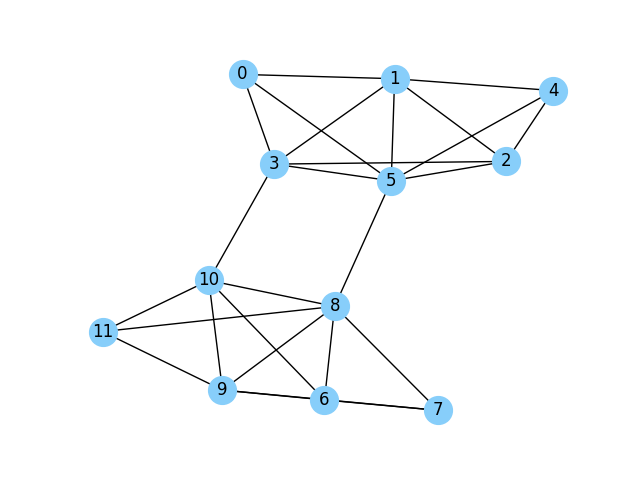

## Kuramoto model for community detection
## Method explanation
Let $E$ be the edge list of the undirected graph $G$. $N$ is the number of nodes.

The dynamic function is
$$
\frac{\partial \theta_i}{\partial t}
= \frac{1}{N}\sum_{j:(i,j) \in E} \sin(\theta_j - \theta_i)
$$

Local order during simulation step

$$r_{c}=\frac{1}{|E|}\sum_{(i,j) \in E}e^{ |\theta_{i} - \theta_{j}| } $$

Solve the ODE until $r_c$ is near 1.
This can be used as a termination condition
for the algorithm.

Then we use $[\theta_1, \dots, \theta_N]$
to cluster the nodes into different community.
## Example


For the above graph with 12 nodes. After $t = 69$ we can obtain
$r_c\geq 0.99$, and the phases are 
```Python
[4.85074828 4.84967319 4.84943349 4.86083052 4.846165   4.85887088
 4.91879579 4.92206347 4.90935898 4.91855667 4.90739992 4.91748298]
```

## Pros and Cons
Pros: This method is bio-inspired, and shows potential in plausible explanation
and theoretical justification.

Cons:
1. **Slow** as the number of nodes grows large,
since we need to solve an ODE system with $N$ variables.
2. **Low accuracy** compared with other methods.
We test this method on SBM(100,2,16,4), which shows that
it has low accuracy compared with SDP-based method.

## Reference
Implementation of `syncnet` in [`pyclustering`](https://pyclustering.github.io/).


